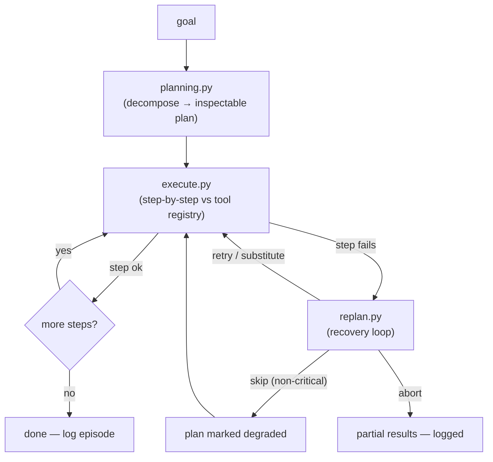
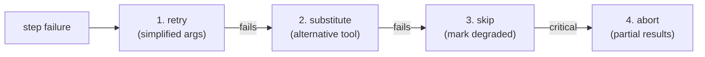
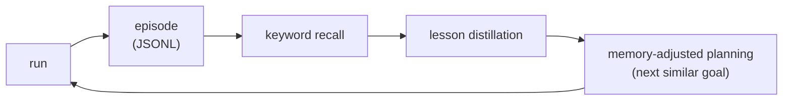

# Deep agents: architecture

## Plan → execute → replan

```mermaid
flowchart TD
    G["goal"] --> PL["planning.py\n(decompose → inspectable plan)"]
    PL --> EX["execute.py\n(step-by-step vs tool registry)"]
    EX -->|"step ok"| NX{"more steps?"}
    NX -->|"yes"| EX
    NX -->|"no"| DONE["done — log episode"]
    EX -->|"step fails"| RP["replan.py\n(recovery loop)"]
    RP -->|"retry / substitute"| EX
    RP -->|"skip (non-critical)"| DEG["plan marked degraded"]
    RP -->|"abort"| PART["partial results — logged"]
    DEG --> EX
```

## Recovery ladder (bounded, ordered by cost)

```mermaid
flowchart LR
    F["step failure"] --> R1["1. retry\n(simplified args)"]
    R1 -->|"fails"| R2["2. substitute\n(alternative tool)"]
    R2 -->|"fails"| R3["3. skip\n(mark degraded)"]
    R3 -->|"critical"| R4["4. abort\n(partial results)"]
```

## Episodic memory loop

```mermaid
flowchart LR
    RUN["run"] --> EP["episode\n(JSONL)"]
    EP --> REC["keyword recall"]
    REC --> LES["lesson distillation"]
    LES --> PLAN2["memory-adjusted planning\n(next similar goal)"]
    PLAN2 --> RUN
```
